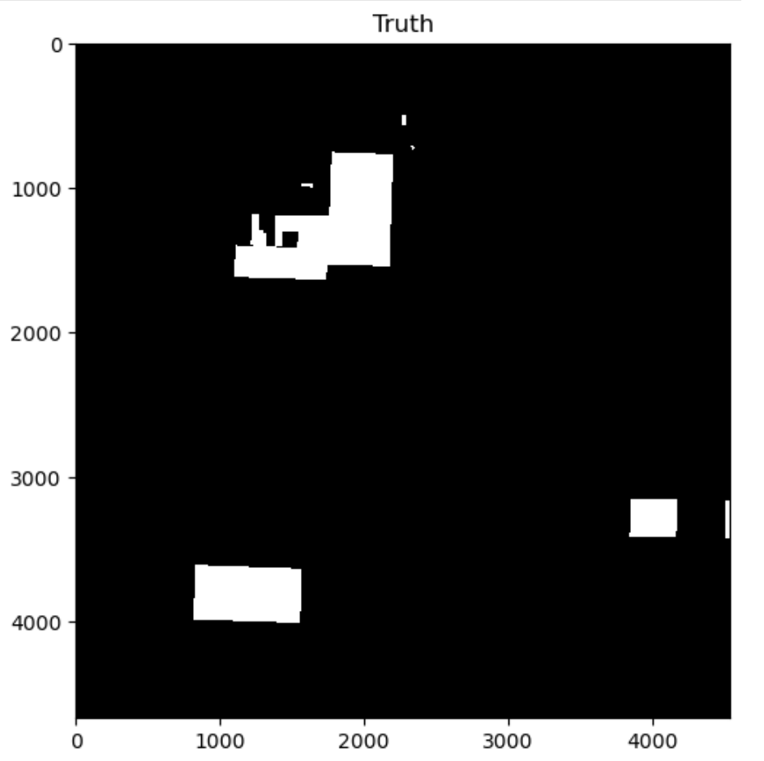
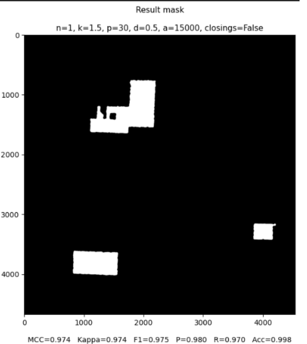

# Sentinel-1 Change Detection Toolbox

This toolbox is designed for unsupervised deforestation detection using Sentinel-1 SAR imagery. It provides a pipeline processing orthorectified SAR under geotiff format (might be updated in the future to take in raw S1 SLC files as input) into binary change masks.

---

## 📢 PROJECT STATUS & UPDATES
> **[IMPORTANT]** This project is under development. **Updates are incoming, particularly regarding the documentation. Until then, a power-point (in French) presenting the tool is already availbale in /assets/doc.**

---

## 🖼️ Workflow Illustration

| Ground Truth (Reference) | Result Mask (Prediction) |
|:---:|:---:|
|  |  |

*Example of clear deforestation between June and December in Gran Chaco, Paraguay.*

*Nicer visuals incoming: This space is reserved for the upcoming high-resolution workflow diagram.*

---

## 🚀 Very quick review of the main 

The toolbox is divided into three main modules:

### 1. Detection Pipeline (`main_dtod_test.py`)
The `main()` function handles the core logic:
- **Preprocessing:** Normalization and clipping of input rasters.
- **Dissimilarity:** Computing the difference between two dates (SAR intensity changes).
- **Tiling & Otsu:** Splitting the image into tiles to apply adaptive thresholding, allowing for local variations in backscatter.
- **Filtering:** Post-processing to remove noise and small objects using morphological operations and a handcrafted density filter.

### 2. Evaluation (`ground_truth.py`)
This module allows you to validate your results against reference data so as to test the pipeline performances:
- **Rasterization:** Convert polygon shapefiles into binary masks aligned with your imagery.
- **Metrics:** Compute statistical performance indicators including **F1-Score**, **MCC** (Matthews Correlation Coefficient), and **Kappa**.

### 3. SAR Preprocessing (`src/preprocess/`)
Turns raw Sentinel-1 products into the pre/post GeoTIFFs consumed by the detection pipeline, by running SNAP GPT graphs stored in `vigisar_graphs/`:
- **SLC workflow** (`main_preprocess.py`): backscatter stack + pre/post coherence, then gathering into `<name>_pre.tif` / `<name>_post.tif` with bands `gamma0_VH`, `gamma0_VV`, `coh_VH`, `coh_VV`.
- **GRD workflow** (`main_preprocess_grd.py`): backscatter only (`gamma0_VH`, `gamma0_VV`).

> **Band naming & master/slave conventions.** SNAP band names (dates, `_mst`/`_slv`, subswath) are unreliable, so the pipeline never parses them: it relies on the **order of the sources** in the graphs (first source = master, bands written first) and on Collocate suffixes (`_M`, `_S0`, `_S1`) that are *predicted* by the Python code. These couplings and the resulting conventions are documented **directly inside the graph files** — see the header comment of `vigisar_graphs/gathering.xml` and the comments on the `CreateStack` / `Back-Geocoding` nodes in `backscatter.xml`, `backscatter_grd.xml` and `coherence.xml`, as well as the docstring of `_resolve_gathering_bands` in `src/preprocess/run_graphs.py`. Read them before editing a graph or re-saving it from SNAP's Graph Builder.

